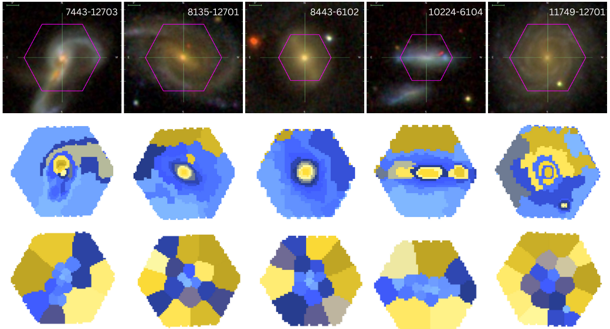

# Capivara 

[](https://arxiv.org/abs/2410.21962)
[](https://github.com/RafaelSdeSouza/capivara/blob/main/LICENSE) 
[](https://codecov.io/gh/RafaelSdeSouza/capivara)
[](https://github.com/RafaelSdeSouza/capivara/commits)

## Overview

Capivara: A Spectral-based Segmentation Method for IFU Data Cubes implements a spectral-based segmentation method for Integral Field Unit (IFU) data cubes. Designed with astronomers in mind, it facilitates the decomposition of spectral data into regions of similar physical properties, leveraging advanced matrix operations via **torch** for GPU acceleration.




## Installation

Install Capivara from GitHub using the following commands:

```R
install.packages('remotes')
remotes::install_github("RafaelSdeSouza/capivara")
library(capivara)
```

## Usage

### MaNGA Data Cube

This example demonstrates how to use **capivara** to segment an IFU from the MaNGA survey:

```R
require(capivara)
# Read the MaNGA datacube
cube <- FITSio::readFITS("manga-7443-12703-LOGCUBE.fits")

# Apply Capivara segmentation
res <- capivara::segment(cube,Ncomp=20)

# Plot the segmented region
plot <- plot_cluster(res)
print(plot)
```
Attribution
-----------

Please cite de Souza et al (2024) if you find this code useful in your
research. The temporary BibTeX entry for the paper is:

    @ARTICLE{2024arXiv241021962D,
       author = {{de Souza}, Rafael S. and {Dahmer-Hahn}, Luis G. and {Shen}, Shiyin and {Chies-Santos}, Ana L. and {Chen}, Mi and {Rahna}, P.~T. and {Ye}, Renhao and {Tahmasebzade}, Behzad},
        title = "{Capivara: A Spectral-based Segmentation Method for IFU Data Cubes}",
      journal = {arXiv e-prints},
     keywords = {Astrophysics - Astrophysics of Galaxies, Astrophysics - Instrumentation and Methods for Astrophysics},
         year = 2024,
        month = oct,
          eid = {arXiv:2410.21962},
        pages = {arXiv:2410.21962},
          doi = {10.48550/arXiv.2410.21962}}

## Dependencies

- **torch**: Efficient tensor computations with GPU support.
- **ggplot2**: Visualization.
- **FITSio**: Reading and handling FITS files.
- **reshape2**: Data manipulation.

## References

1. **MaNGA Survey**: Bundy, Kevin, et al. "Overview of the SDSS-IV MaNGA Survey: Mapping Nearby Galaxies at Apache Point Observatory." The Astrophysical Journal 798.1 (2015): 7. DOI: [10.1088/0004-637X/798/1/7](https://doi.org/10.1088/0004-637X/798/1/7)
2. **Capivara Methodology**: Souza, Rafael S. de, et al. "Capivara: A Spectral-Based Segmentation Method for IFU Data Cubes." arXiv preprint (2024). DOI: [10.48550/arXiv.2410.21962](https://arxiv.org/abs/2410.21962)
3. **Torch in R**: Paszke, Adam, et al. "PyTorch: An Imperative Style, High-Performance Deep Learning Library." Advances in Neural Information Processing Systems. 2019.

---
For more information, check the [Capivara GitHub webpage](https://rafaelsdesouza.github.io/capivara/).


