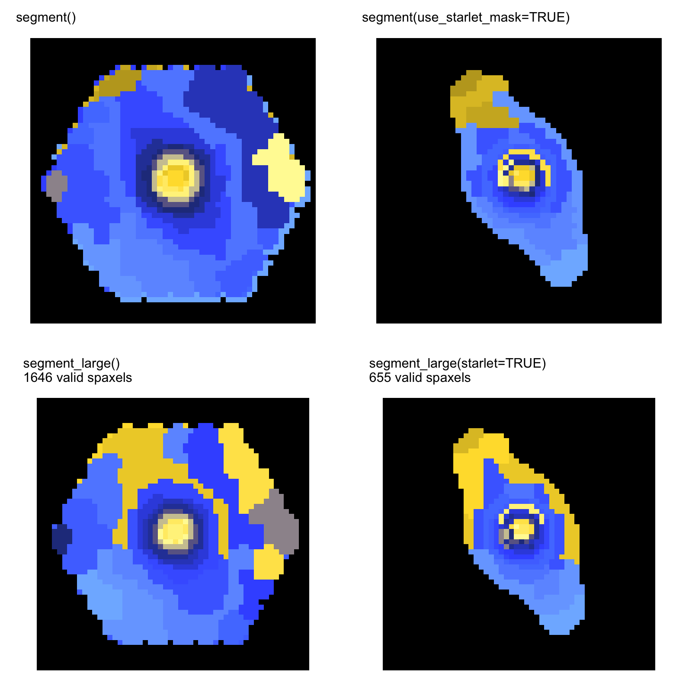

# Capivara 

[](https://arxiv.org/abs/2410.21962)
[](https://github.com/RafaelSdeSouza/capivara/blob/main/LICENSE)
[](https://codecov.io/gh/RafaelSdeSouza/capivara)
[](https://github.com/RafaelSdeSouza/capivara/commits)

Spectral segmentation and morphology-aware decomposition for
astronomical data cubes.

Capivara defines spatial regions directly from IFU spectra. It keeps the
core workflow intentionally focused: build a scientifically meaningful
support mask, cluster spectra into coherent regions, and export
flux-preserving regional spectra for downstream analysis.

## Website

The package website is the main documentation entry point:

- [Capivara website](https://rafaelsdesouza.github.io/capivara/)

## Installation

``` r
install.packages("remotes")
remotes::install_github("RafaelSdeSouza/capivara")
library(capivara)
```

Optional GPU acceleration:

``` r
install.packages("torch")
torch::install_torch()
```

`torch` is optional. Capivara falls back to base R distance calculations
when it is not installed.

## Minimal workflow

``` r
library(capivara)
library(FITSio)

x <- FITSio::readFITS("manga-8140-12703-LOGCUBE.fits")

seg <- segment_large(
  input = x,
  Ncomp = 25,
  use_starlet_mask = TRUE,
  starlet_J = 5,
  starlet_scales = 2:5,
  knn_k = 100
)

print(seg$backend_info)
print(table(seg$cluster_map, useNA = "ifany"))

plot_cluster(seg)

spectra <- summarize_cluster_spectra(seg)

sum_spectra <- spectra$sum_spectra
median_spectra <- spectra$median_spectra
print(head(sum_spectra))

write.csv(sum_spectra, "capivara_sum_spectra.csv", row.names = FALSE)
saveRDS(seg, "capivara_segmentation.rds")
```

Use the summed spectra for flux-preserving science products and the
median spectra for robust visual inspection. `use_starlet_mask = TRUE`
turns on the foreground-support mask; `use_starlet_mask = FALSE` runs on
all valid spaxels. There is no separate starlet segmentation entry
point.

By default, `feature_wavelength_range = NULL`, so the segmentation uses
all available wavelength channels. To segment only on a spectral window,
for example around a chosen emission-line complex, pass a two-element
wavelength interval. The binning is learned from that window, but the
returned `original_cube` remains the full cube, so
`summarize_cluster_spectra()` still exports full flux-preserving
spectra.

``` r
# Example only: choose the interval for your cube's wavelength frame.
line_window <- c(lambda_min, lambda_max)

seg_ha <- segment_large(
  input = x,
  Ncomp = 25,
  use_starlet_mask = TRUE,
  knn_k = 100,
  feature_wavelength_range = line_window
)

ha_spectra <- summarize_cluster_spectra(seg_ha)$sum_spectra
```

When using `target_snr`, `wavelength_range` has a different role: it
selects the spectral interval used to evaluate the SNR screen. This
keeps line-focused segmentation and SNR quality control independent.

## Plotting and saving the segmentation map

Both `segment()` and `segment_large()` return the spatial binning scheme
in `seg$cluster_map`. This is a 2-D matrix with the same spatial
footprint as the input cube. Pixels outside the support mask are stored
as `NA`; for DS9 and most FITS-based workflows it is usually clearer to
write those pixels as `0` and keep the Capivara regions as positive
integer labels.

``` r
plot_cluster(seg)

cluster_map <- seg$cluster_map

# DS9-friendly convention:
#   0  = outside the Capivara support / unassigned background
#   >0 = Capivara region id
cluster_map_fits <- cluster_map
cluster_map_fits[is.na(cluster_map_fits)] <- 0L
storage.mode(cluster_map_fits) <- "integer"

FITSio::writeFITSim(
  cluster_map_fits,
  file = "capivara_segmentation_map.fits",
  c1 = "Capivara segmentation map: 0=background, positive integers=regions"
)
```

If you want to preserve the spatial WCS from the original cube, reuse
the first two axes from the input FITS object when they are available:

``` r
spatial_ax <- NA
if (!is.null(seg$axDat) && is.data.frame(seg$axDat) && nrow(seg$axDat) >= 2) {
  spatial_ax <- seg$axDat[1:2, , drop = FALSE]
}

FITSio::writeFITSim(
  cluster_map_fits,
  file = "capivara_segmentation_map_wcs.fits",
  axDat = spatial_ax,
  header = seg$header,
  c1 = "Capivara segmentation map: 0=background, positive integers=regions"
)
```

The saved FITS image contains the bin number at each spatial pixel. It
is the same binning scheme used by `summarize_cluster_spectra()`, so
region `k` in the FITS map corresponds to row/bin `k` in the exported
summed or median spectra.

## Large cubes

The standard Ward workflow is exact, but it stores all pairwise
distances. For large cubes, memory grows quadratically with the number
of valid pixels.

``` r
estimate_segment_memory(x)
```

When the exact backend is too expensive in RAM, use the sparse-Ward
backend:

``` r
seg <- segment_large(
  input = x,
  Ncomp = 50,
  use_starlet_mask = TRUE,
  knn_k = 100
)
```

`segment_large()` mirrors the output structure of `segment()` while
avoiding the full all-pairs distance matrix. Its default validity screen
follows Sagui’s sparse-Ward backend for coherent kNN graphs. Increasing
`knn_k` makes the graph denser and usually closer to exact Ward;
`knn_k = 100` is a good visual/science starting point for MaNGA- or
JPAS-style examples.

## Starlet support masks

Capivara can build a Sagui-style white-light starlet support before
clustering. The mask is computed on the full spatial footprint and then
applied back to the cube.

``` r
seg <- segment_large(
  input = x,
  Ncomp = 25,
  use_starlet_mask = TRUE,
  starlet_J = 5,
  starlet_scales = 2:5,
  include_coarse = FALSE,
  denoise_k = 0,
  positive_only = TRUE,
  mask_mode = "na",
  knn_k = 100
)
```

## Core API

Capivara keeps the public segmentation API small:

- `segment()` is the standard exact Ward segmentation.
- `segment_large()` is the memory-safe sparse-Ward segmentation.
- `use_starlet_mask = TRUE/FALSE` controls whether either backend
  applies a starlet foreground support before clustering.
- `estimate_segment_memory()` estimates the exact Ward memory lower
  bound.
- `summarize_cluster_spectra()` exports region spectra.
- `reconstruct_cluster_cube()` builds representative reconstructed
  cubes.
- `reconstruct_flux_preserving_cube()` builds flux-preserving model
  cubes for fitting workflows.

## Companion packages

Capivara 2.0 includes a native kinematics module: emission-line maps,
kinematic-aware and path-signature segmentation, and an axisymmetric disc
model. `spectropath` is installed automatically with Capivara and provides the
path-signature features. The bisymmetric bar model is available, but it is an
explicit physical hypothesis rather than a default for every galaxy.

For kinematic segmentation alone:

```r
kinematic_segments <- segment_kinematics(
  cube_path = "/path/to/manga-8078-12703-LOGCUBE.fits",
  redshift = NA_real_,
  emission_line = "halpha",
  segmentation_mode = "kinematic",
  knn_k = 50,
  n_segments = 25,
  show_plots = TRUE
)
```

For the default disc model:

```r
result <- run_kinematic_analysis(
  cube_path = "/path/to/manga-8078-12703-LOGCUBE.fits",
  redshift = NA_real_,
  emission_line = "halpha",
  segmentation_mode = "kinematic",
  model = "axisymmetric",
  knn_k = 50,
  n_segments = 25,
  show_plots = TRUE
)
```

For a galaxy already known to be barred, opt into the bar module and supply the
bar angle measured from imaging:

```r
bar_result <- run_kinematic_analysis(
  cube_path = "/path/to/manga-8078-12703-LOGCUBE.fits",
  emission_line = "halpha",
  model = "bisymmetric_bar",
  model_control = list(bar_phi_deg = 41),
  show_plots = TRUE
)
```

For an editable RStudio version, open the installed script with:

```r
file.edit(system.file("tutorials", "run_kinematic_analysis.R", package = "capivara"))
```

The website has separate kinematics and bar-modelling guides, so ordinary
rotation analysis does not inherit bar-specific settings.

`capivaraPPXF` remains a separate fitting companion because it wraps a distinct
stellar-population and spectral-fitting workflow:

- [`capivaraPPXF`](https://github.com/RafaelSdeSouza/capivaraPPXF):
  pPXF-based stellar populations, stellar/gas kinematics, emission-line
  measurements, and BPT-style diagnostics.
- [`sagui`](https://github.com/RafaelSdeSouza/sagui): photometric
  segmentation and regional SED extraction.
- [`saguiSED`](https://github.com/RafaelSdeSouza/saguiSED): SED fitting
  for Sagui regional photometry.

This keeps one coherent Capivara analysis workflow while leaving specialised
fitting packages independent.

## Visual example

This panel shows the exact and scalable segmentation APIs with and
without the starlet support mask.



## Citation

If you use Capivara in your research, please cite:

``` bibtex
@article{desouza2025capivara,
  author = {de Souza, Rafael S. and Dahmer-Hahn, Luis G. and Shen, Shiyin and Chies-Santos, Ana L. and Chen, Mi and Rahna, P. T. and Ye, Renhao and Tahmasebzade, Behzad},
  title = {CAPIVARA: a spectral-based segmentation method for IFU data cubes},
  journal = {Monthly Notices of the Royal Astronomical Society},
  year = {2025},
  volume = {539},
  number = {4},
  pages = {3166--3179},
  doi = {10.1093/mnras/staf688}
}
```

Related methods used by Capivara examples:

``` bibtex
@article{desouza2026sagui,
  author = {de Souza, Rafael S. and Wille, Andressa and Shenoy, Shravya and Patil, Aarya A. and Krone-Martins, Alberto and Chies-Santos, Ana L. and Boehm, Celine and Rosa, Reinaldo R. and Pessi, Thallis and Ishida, Emille E. O. and Dage, Kristen C. and Nakazono, Lilianne and Darc, Phelipe and Durgesh, Rupesh},
  title = {SAGUI: SED-based Segmentation of Multi-band Galaxy Images -- Application to JADES in GOODS-South},
  journal = {Monthly Notices of the Royal Astronomical Society},
  year = {2026},
  doi = {10.1093/mnras/stag1062},
  eprint = {2604.18812},
  archivePrefix = {arXiv},
  primaryClass = {astro-ph.GA},
  url = {https://doi.org/10.1093/mnras/stag1062}
}

@article{desouza2026pathsignatures,
  author = {de Souza, Rafael S. and Bunk, Severin},
  title = {The Hidden Geometry of Astrophysical Spectra: Path-Signatures of Line Profiles},
  year = {2026},
  eprint = {2606.27432},
  archivePrefix = {arXiv},
  primaryClass = {astro-ph.IM},
  url = {https://arxiv.org/abs/2606.27432}
}
```

## Scope

Capivara focuses on:

- IFU/hyperspectral segmentation
- starlet-based support masks
- exact and sparse-Ward spectral clustering
- missing-data-safe cube handling
- flux-preserving regional spectra
- clean handoff to fitting packages such as `capivaraPPXF`
