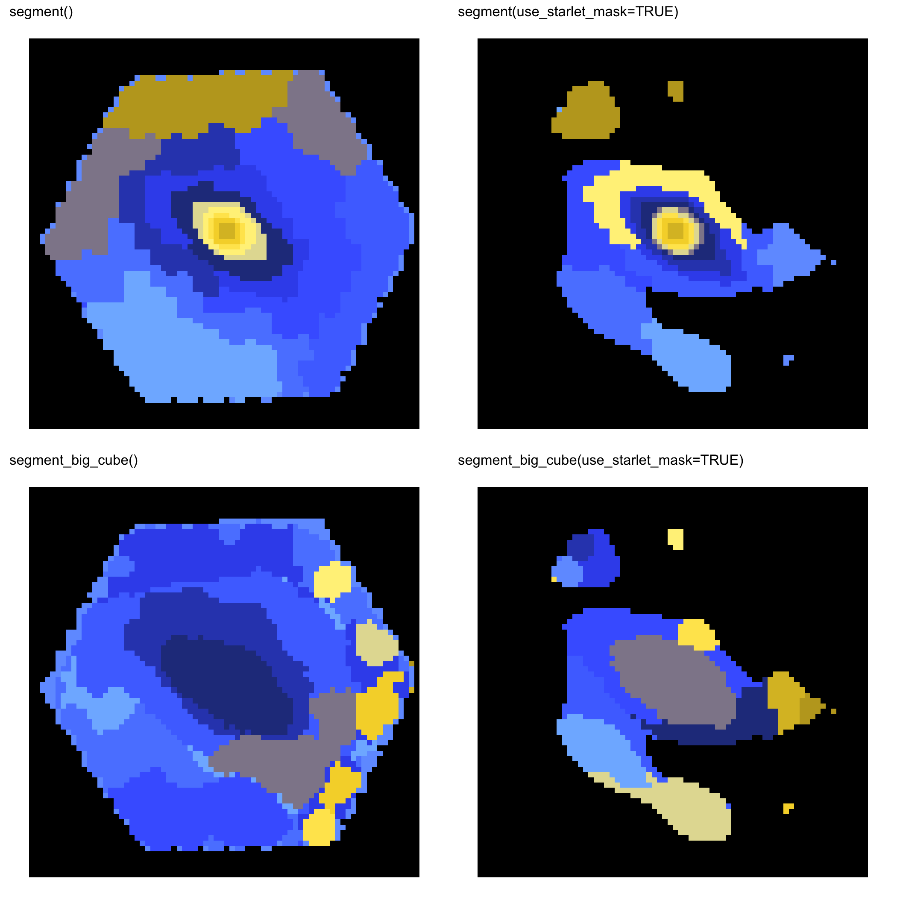
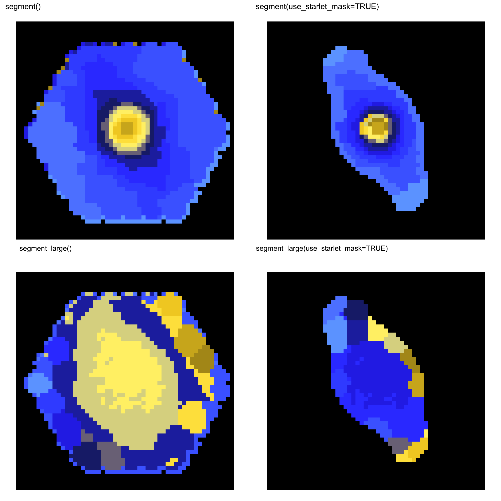
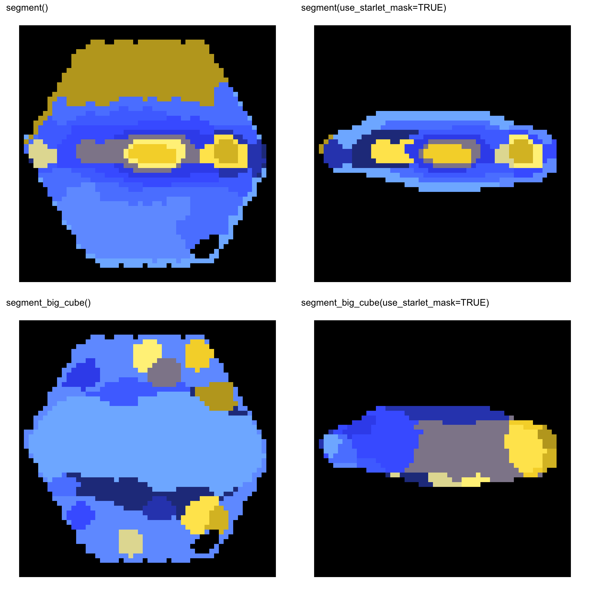
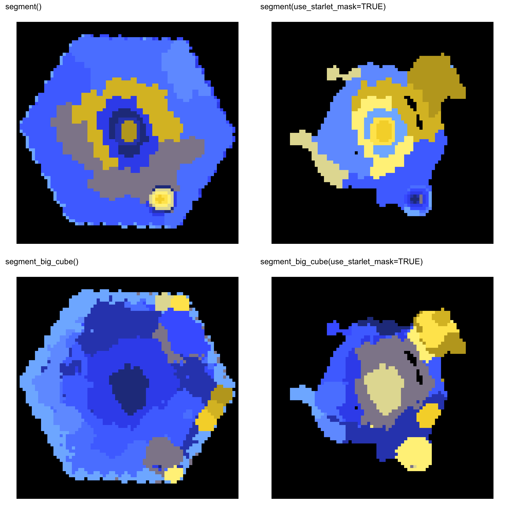

# Capivara 

[](https://arxiv.org/abs/2410.21962)
[](https://github.com/RafaelSdeSouza/capivara/blob/main/LICENSE)
[](https://codecov.io/gh/RafaelSdeSouza/capivara)
[](https://github.com/RafaelSdeSouza/capivara/commits)

Spectral segmentation and morphology-aware decomposition for astronomical data
cubes.

Capivara defines spatial regions directly from IFU spectra. It keeps the core
workflow intentionally focused: build a scientifically meaningful support mask,
cluster spectra into coherent regions, and export flux-preserving regional
spectra for downstream analysis.

## Website

The package website is the main documentation entry point:

- [Capivara website](https://rafaelsdesouza.github.io/capivara/)

## Installation

```r
install.packages("remotes")
remotes::install_github("RafaelSdeSouza/capivara")
library(capivara)
```

Optional GPU acceleration:

```r
install.packages("torch")
torch::install_torch()
```

`torch` is optional. Capivara falls back to base R distance calculations when
it is not installed.

## Minimal workflow

```r
library(capivara)
library(FITSio)

x <- FITSio::readFITS("manga-8140-12703-LOGCUBE.fits")

seg <- segment(
  input = x,
  Ncomp = 25,
  use_starlet_mask = TRUE,
  starlet_J = 5,
  starlet_scales = 2:5
)

plot_cluster(seg)

spectra <- summarize_cluster_spectra(seg)

sum_spectra <- spectra$sum_spectra
median_spectra <- spectra$median_spectra
```

Use the summed spectra for flux-preserving science products and the median
spectra for robust visual inspection.

## Large cubes

The standard Ward workflow is exact, but it stores all pairwise distances. For
large cubes, memory grows quadratically with the number of valid pixels.

```r
estimate_segment_memory(x)
```

When the exact backend is too expensive in RAM, use the sparse-Ward backend:

```r
seg <- segment_large(
  input = x,
  Ncomp = 50,
  use_starlet_mask = TRUE,
  knn_k = 50
)
```

`segment_large()` mirrors the output structure of `segment()` while avoiding the
full all-pairs distance matrix. This is the recommended route for large MaNGA,
MUSE, LSST, JPAS, and ALMA-style cubes.

## Starlet support masks

Capivara can build a Sagui-style white-light starlet support before clustering.
The mask is computed on the full spatial footprint and then applied back to the
cube.

```r
seg <- segment(
  input = x,
  Ncomp = 25,
  use_starlet_mask = TRUE,
  starlet_J = 5,
  starlet_scales = 2:5,
  include_coarse = FALSE,
  denoise_k = 0,
  positive_only = TRUE,
  mask_mode = "na"
)
```


## Core API

Capivara keeps the public segmentation API small:

- `segment()` is the standard exact Ward segmentation.
- `segment_large()` is the memory-safe sparse-Ward segmentation.
- `estimate_segment_memory()` estimates the exact Ward memory lower bound.
- `summarize_cluster_spectra()` exports region spectra.
- `reconstruct_cluster_cube()` builds representative reconstructed cubes.
- `reconstruct_flux_preserving_cube()` builds flux-preserving model cubes for
  fitting workflows.

## Companion packages

Capivara is the segmentation layer. Companion packages can consume the same
region maps and summed spectra:

- [`capivaraPPXF`](https://github.com/RafaelSdeSouza/capivaraPPXF): pPXF-based
  stellar populations, stellar/gas kinematics, emission-line measurements, and
  BPT-style diagnostics.
- [`sagui`](https://github.com/RafaelSdeSouza/sagui): photometric segmentation
  and regional SED extraction.
- [`saguiSED`](https://github.com/RafaelSdeSouza/saguiSED): SED fitting for
  Sagui regional photometry.

This separation keeps Capivara installable and focused while still allowing a
complete analysis workflow.

## Reproducible examples

The panels below were generated with the public API on full MaNGA cubes.

### MaNGA 8135-12701



### MaNGA 8443-6102



### MaNGA 10224-6104



### MaNGA 11749-12701



## Citation

If you use Capivara in your research, please cite:

```bibtex
@article{desouza2025capivara,
  author = {de Souza, Rafael S. and Dahmer-Hahn, Luis G. and Shen, Shiyin and Chies-Santos, Ana L. and Chen, Mi and Rahna, P. T. and Ye, Renhao and Tahmasebzade, Behzad},
  title = {CAPIVARA: a spectral-based segmentation method for IFU data cubes},
  journal = {Monthly Notices of the Royal Astronomical Society},
  year = {2025},
  volume = {539},
  number = {4},
  pages = {3166--3179},
  doi = {10.1093/mnras/staf688}
}
```

## Scope

Capivara focuses on:

- IFU/hyperspectral segmentation
- starlet-based support masks
- exact and sparse-Ward spectral clustering
- missing-data-safe cube handling
- flux-preserving regional spectra
- clean handoff to fitting packages such as `capivaraPPXF`
