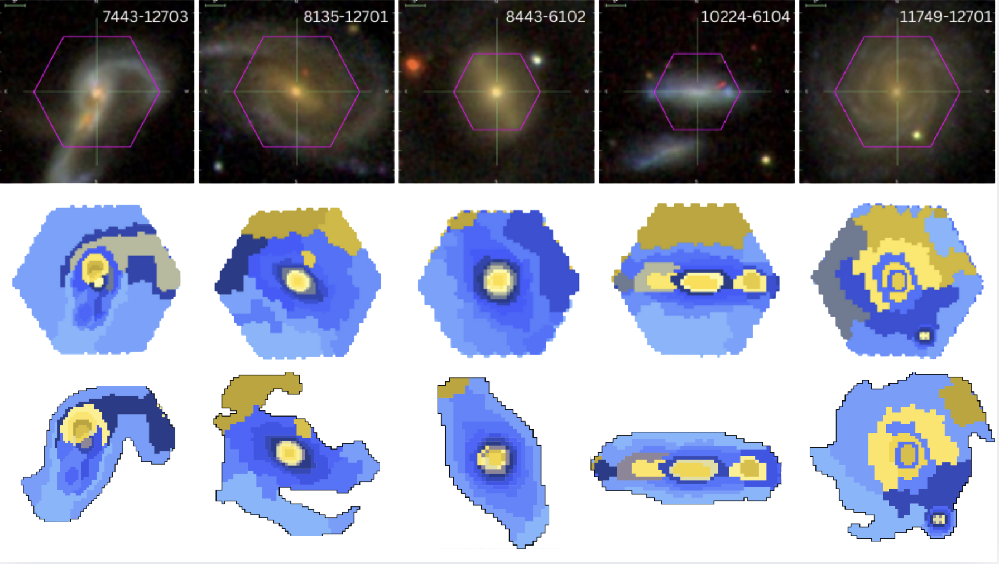
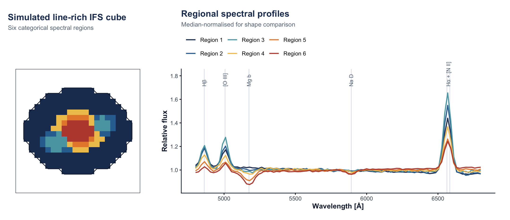

# Capivara 

Capivara performs spectral segmentation of integral-field spectroscopy (IFS)
cubes, assigning eligible spaxels to regions with coherent spectra and
returning flux-preserving regional spectra.

[Peer-reviewed paper](https://doi.org/10.1093/mnras/staf688) ·
[arXiv:2410.21962](https://arxiv.org/abs/2410.21962)

<figure class="science-figure">

<figcaption>Real MaNGA galaxies and their Capivara region maps. Colours identify regions and do not represent an ordered quantity.</figcaption>
</figure>

The workflow has four stages:

<ol class="science-flow">
<li>IFS cube</li>
<li>spatial support</li>
<li>spectral regions</li>
<li>regional spectra</li>
</ol>

## Installation {#installation}

```r
install.packages("remotes")
remotes::install_github("RafaelSdeSouza/capivara", upgrade = "never")
library(capivara)
```

`torch` is optional. The example below runs with the standard package
dependencies.

## Quick start {#quick-start}

This fixed-seed example creates a small synthetic IFS cube. Its four profiles
contain Hβ, [O III], Mg b, Na D, Hα, and [N II] features mixed across a bulge,
disc, nucleus, and two star-forming knots.

```{r synthetic-cube}
library(capivara)

set.seed(241021962)
n_row <- 24L
n_col <- 24L
n_wave <- 96L
wavelength <- seq(4800, 6800, length.out = n_wave)
gaussian <- function(centre, width) {
  exp(-0.5 * ((wavelength - centre) / width)^2)
}

row_id <- row(matrix(0, n_row, n_col))
col_id <- col(matrix(0, n_row, n_col))
x <- (col_id - 12.5) / 10
y <- (row_id - 12.5) / 8
radius <- sqrt(x^2 + y^2)
support <- radius <= 1

profiles <- rbind(
  bulge = 1.12 + 0.00005 * (wavelength - 5800) -
    0.18 * gaussian(5175, 38) - 0.07 * gaussian(5892, 28) +
    0.05 * gaussian(6563, 24),
  disc = 0.86 - 0.00003 * (wavelength - 5800) +
    0.13 * gaussian(4861, 23) + 0.12 * gaussian(5007, 24) +
    0.34 * gaussian(6563, 26) + 0.10 * gaussian(6583, 18),
  knot = 0.72 + 0.28 * gaussian(4861, 21) +
    0.46 * gaussian(5007, 22) + 0.85 * gaussian(6563, 23) +
    0.18 * gaussian(6583, 16),
  nucleus = 0.98 + 0.15 * gaussian(4861, 22) +
    0.42 * gaussian(5007, 23) + 0.48 * gaussian(6563, 24) +
    0.42 * gaussian(6583, 17)
)

w_bulge <- exp(-0.5 * (radius / 0.25)^2)
w_nucleus <- exp(-0.5 * (radius / 0.10)^2)
w_knots <-
  exp(-((x - 0.48)^2 + (y + 0.16)^2) / (2 * 0.12^2)) +
  exp(-((x + 0.40)^2 + (y - 0.28)^2) / (2 * 0.14^2))
w_disc <- 1 - w_bulge
w_disc[w_disc < 0.12] <- 0.12

cube <- array(NA_real_, dim = c(n_row, n_col, n_wave))
for (i in seq_len(n_row)) {
  for (j in seq_len(n_col)) {
    if (support[i, j]) {
      weights <- c(w_bulge[i, j], w_disc[i, j],
                   w_knots[i, j], w_nucleus[i, j])
      weights <- weights / sum(weights)
      brightness <- 0.45 + 0.9 * exp(-1.7 * radius[i, j]) +
        0.35 * w_knots[i, j]
      profile <- drop(weights %*% profiles)
      cube[i, j, ] <- brightness * profile + rnorm(n_wave, 0, 0.008)
    }
  }
}

seg <- segment(
  input = list(imDat = cube),
  Ncomp = 6,
  use_starlet_mask = FALSE
)
spectra <- summarize_cluster_spectra(seg)

regional_products <- data.frame(
  region = spectra$cluster_ids,
  n_spaxels = unname(spectra$n_spaxels),
  summed_flux = round(rowSums(spectra$sum_spectra), 1)
)
knitr::kable(regional_products)
```

The integer values are categorical region identifiers. `NA` in
`seg$cluster_map` means that the spaxel was outside the eligible support. The
table reports the number of assigned spaxels and the wavelength-integrated sum
of each regional spectrum.

```r
plot_cluster(seg)
```

```{r synthetic-map, include=FALSE, fig.path="man/figures/capivara-first-run-", fig.width=12, fig.height=5.2, dpi=180}
region_palette <- c(
  "#203a5f", "#2f6f9f", "#58a4b0",
  "#f0c45c", "#e58938", "#b94b3b"
)
map_data <- data.frame(
  x = rep(seq_len(n_col), each = n_row),
  y = rep(seq_len(n_row), times = n_col),
  region = factor(as.vector(seg$cluster_map))
)
support_data <- transform(map_data, in_support = as.numeric(support))

map_plot <- ggplot2::ggplot(
  subset(map_data, !is.na(region)),
  ggplot2::aes(x, y, fill = region)
) +
  ggplot2::geom_blank(
    data = map_data,
    ggplot2::aes(x = x, y = y),
    inherit.aes = FALSE
  ) +
  ggplot2::geom_raster() +
  ggplot2::geom_contour(
    data = support_data,
    ggplot2::aes(x = x, y = y, z = in_support),
    breaks = 0.5,
    colour = "#14233a",
    linewidth = 0.55,
    inherit.aes = FALSE
  ) +
  ggplot2::scale_fill_manual(values = region_palette, guide = "none") +
  ggplot2::scale_x_continuous(expand = c(0, 0)) +
  ggplot2::scale_y_reverse(expand = c(0, 0)) +
  ggplot2::coord_equal() +
  ggplot2::labs(
    title = "Simulated line-rich IFS cube",
    subtitle = "Six categorical spectral regions"
  ) +
  ggplot2::theme_void(base_size = 12) +
  ggplot2::theme(
    plot.title = ggplot2::element_text(
      colour = "#203a5f", face = "bold", size = 15
    ),
    plot.subtitle = ggplot2::element_text(colour = "#667587", size = 10.5),
    panel.border = ggplot2::element_rect(
      colour = "#14233a", fill = NA, linewidth = 0.55
    ),
    plot.margin = ggplot2::margin(12, 14, 12, 8)
  )

median_scaled <- sweep(
  spectra$median_spectra,
  1,
  apply(spectra$median_spectra, 1, median),
  "/"
)
spectral_data <- data.frame(wavelength, t(median_scaled), check.names = FALSE)
names(spectral_data)[-1] <- paste("Region", spectra$cluster_ids)
spectral_data <- tidyr::pivot_longer(
  spectral_data,
  -wavelength,
  names_to = "region",
  values_to = "relative_flux"
)

line_labels <- data.frame(
  wavelength = c(4861, 5007, 5175, 5892, 6573),
  label = c("Hβ", "[O III]", "Mg b", "Na D", "Hα + [N II]")
)
line_labels$y <- max(spectral_data$relative_flux) + 0.055

spectral_plot <- ggplot2::ggplot(
  spectral_data,
  ggplot2::aes(wavelength, relative_flux, colour = region)
) +
  ggplot2::geom_vline(
    xintercept = c(4861, 5007, 5175, 5892, 6563, 6583),
    colour = "#d8dee5",
    linewidth = 0.45
  ) +
  ggplot2::geom_line(linewidth = 0.9, alpha = 0.96) +
  ggplot2::geom_text(
    data = line_labels,
    ggplot2::aes(wavelength, y, label = label),
    inherit.aes = FALSE,
    angle = 90,
    hjust = 0,
    colour = "#667587",
    size = 3.25
  ) +
  ggplot2::scale_colour_manual(values = region_palette) +
  ggplot2::coord_cartesian(
    ylim = c(min(spectral_data$relative_flux) - 0.025, line_labels$y[1] + 0.10),
    clip = "off"
  ) +
  ggplot2::labs(
    title = "Regional spectral profiles",
    subtitle = "Median-normalised for shape comparison",
    x = "Wavelength [Å]",
    y = "Relative flux",
    colour = NULL
  ) +
  ggplot2::theme_classic(base_size = 12) +
  ggplot2::theme(
    plot.title = ggplot2::element_text(
      colour = "#203a5f", face = "bold", size = 15
    ),
    plot.subtitle = ggplot2::element_text(colour = "#667587", size = 10.5),
    axis.title = ggplot2::element_text(colour = "#14233a", face = "bold"),
    axis.text = ggplot2::element_text(colour = "#3f4d5b"),
    axis.line = ggplot2::element_line(colour = "#14233a", linewidth = 0.55),
    legend.position = "top",
    legend.justification = "left",
    legend.key.width = grid::unit(1.4, "lines"),
    plot.margin = ggplot2::margin(12, 20, 12, 10)
  )

patchwork::wrap_plots(
  map_plot,
  spectral_plot,
  widths = c(0.78, 1.75)
)
```

<figure class="science-figure">

<figcaption>Fixed-seed IFS simulation with six Capivara regions and their median-normalised spectra. The vertical annotations mark the input absorption and nebular features.</figcaption>
</figure>

Use `spectra$sum_spectra` for flux-preserving regional spectra. Means and
medians describe spectral shape. The [Get Started
guide](articles/getting-started.html) runs the complete example.

## Continue with

- [Choose the exact or sparse-graph backend](articles/choosing-segmentation-backend.html)
- [Construct and interpret support masks](articles/support-masks.html)
- [Export flux-preserving regional spectra](articles/flux-preserving-products.html)
- [Write FITS maps for DS9](articles/fits-ds9-export.html)
- [View MaNGA examples](articles/examples.html)

## Functions {#core-api}

The [function index](reference/index.html) groups the public API by task.
Kinematic analysis and bisymmetric modelling have separate guides.

## About {#about}

Capivara is an R package for spectral segmentation and post-processing of IFS
data cubes. Use `citation("capivara")` or cite the [MNRAS
paper](https://doi.org/10.1093/mnras/staf688).
