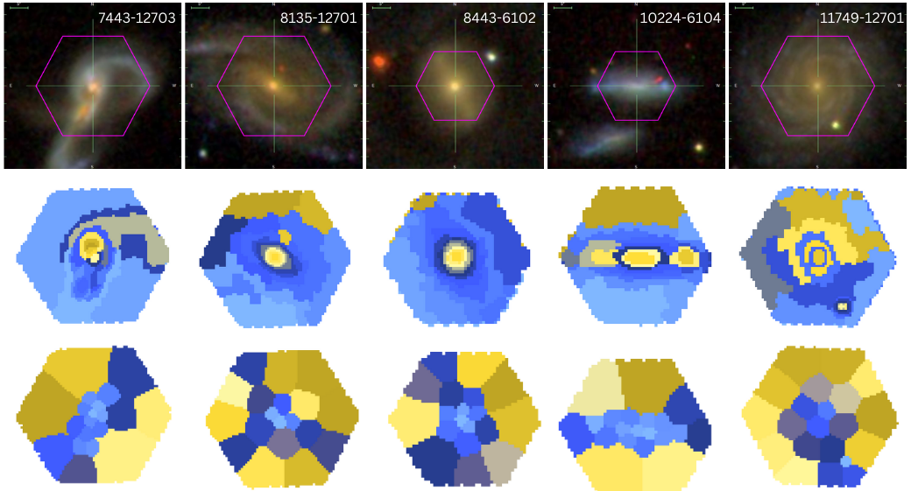
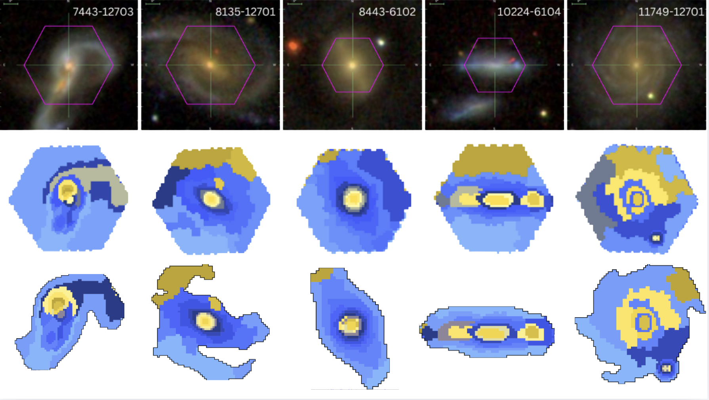
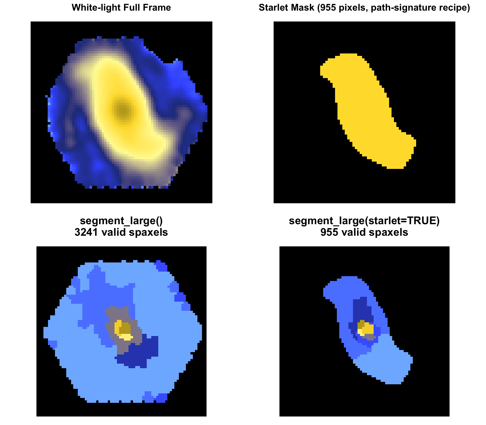

# Capivara 

[](https://arxiv.org/abs/2410.21962)
[](https://github.com/RafaelSdeSouza/capivara/blob/main/LICENSE) 
[](https://codecov.io/gh/RafaelSdeSouza/capivara)
[](https://github.com/RafaelSdeSouza/capivara/commits)

## Overview

Capivara provides spectral segmentation tools for Integral Field Unit (IFU)
data cubes. Version `0.2.0` adds built-in missing-data support in the exact
workflow, a medoid-based large-cube engine, Sagui-style white-light starlet
masking, variance-aware spectral summaries, and SNR-guided component
selection.

The core segmentation API is intentionally small:

- `segment()` for the standard exact workflow, including missing spectral channels.
- `segment_big_cube()` for very large cubes where exact pairwise distances are too expensive in RAM.

### Current Capivara Mosaic



### Sagui Comparison Mosaic



Both mosaics are displayed with the same fixed size to make the visual
comparison easier.

## What's New In 0.2.0

- `segment()` now handles missing spectral channels by default.
- `segment_big_cube()` now uses block medoids rather than block averages, improving compact structures in large cubes.
- both backends can optionally use a Sagui-style starlet mask from the white-light image.
- `summarize_cluster_spectra()` supports median, summed, and weighted spectra.
- `choose_ncomp_by_snr()` selects `Ncomp` from a variance-aware SNR cut.
- `torch` is now optional.

## Installation

```R
install.packages("remotes")
remotes::install_github("RafaelSdeSouza/capivara")
library(capivara)
```

Optional GPU acceleration:

```R
install.packages("torch")
torch::install_torch()
```

## Usage

### Basic Segmentation

```R
cube <- FITSio::readFITS("manga-8140-12703-LOGCUBE.fits")
res <- segment(cube, Ncomp = 20)
plot_cluster(res)
```

### Missing-data-safe Segmentation

`segment()` now handles missing spectral channels directly.

### Large-cube Segmentation

```R
res_large <- segment_big_cube(cube, Ncomp = 20, block_size = 6)
```

### Sagui-style Starlet Segmentation

```R
res_star <- segment(
  cube,
  Ncomp = 20,
  use_starlet_mask = TRUE,
  starlet_J = 5,
  starlet_scales = 2:5,
  include_coarse = FALSE,
  denoise_k = 0,
  positive_only = TRUE,
  mask_mode = "na"
)

plot_cluster(res_star)
```

```R
res_star_large <- segment_big_cube(
  cube,
  Ncomp = 20,
  use_starlet_mask = TRUE,
  block_size = 6
)
```

{fig-align="center" width="100%"}

### Variance-aware Summaries

```R
var_cube <- FITSio::readFITS("manga-8140-12703-VARCUBE.fits")

choice <- choose_ncomp_by_snr(
  cube,
  var_cube = var_cube$imDat,
  k_values = 4:20,
  target_snr = 20
)

res <- segment(cube, Ncomp = choice$Ncomp)
spec_summary <- summarize_cluster_spectra(res, var_cube = var_cube$imDat)
```

### Reconstructed Cubes

```R
rep_cube <- reconstruct_cluster_cube(res_star, template = "median")
fit_cube <- reconstruct_flux_preserving_cube(res_star)
```

## Attribution

If you use the [Capivara code](https://github.com/RafaelSdeSouza/capivara) in
your research, please cite the
[Capivara paper](https://doi.org/10.1093/mnras/staf688).

## Dependencies

- **torch**: Optional GPU-accelerated tensor computations.
- **ggplot2**: Visualization.
- **FITSio**: Reading and handling FITS files.
- **reshape2**: Data manipulation.

## References

1. **MaNGA Survey**: Bundy, Kevin, et al. "Overview of the SDSS-IV MaNGA Survey: Mapping Nearby Galaxies at Apache Point Observatory." The Astrophysical Journal 798.1 (2015): 7. DOI: [10.1088/0004-637X/798/1/7](https://doi.org/10.1088/0004-637X/798/1/7)
2. **Capivara Code**: [RafaelSdeSouza/capivara](https://github.com/RafaelSdeSouza/capivara)
3. **Capivara Methodology**: Souza, R. S. de, *et al.* (2025). **CAPIVARA: A spectral-based segmentation method for IFU data cubes.** *Monthly Notices of the Royal Astronomical Society*, **539**(4), 3166–3179. [https://doi.org/10.1093/mnras/staf688](https://doi.org/10.1093/mnras/staf688)
4. **Torch in R**: Paszke, Adam, et al. "PyTorch: An Imperative Style, High-Performance Deep Learning Library." Advances in Neural Information Processing Systems 2019.
