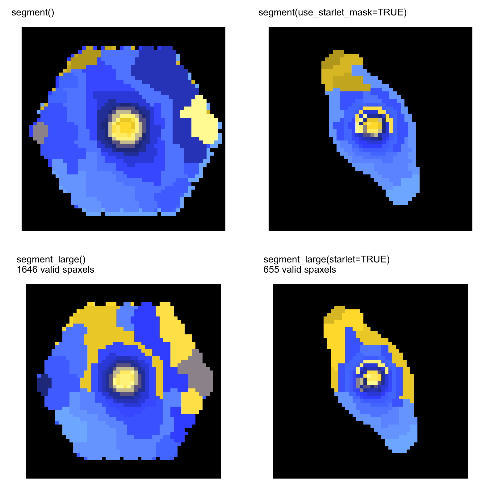

```{r setup, include=FALSE}
knitr::opts_chunk$set(collapse=TRUE, comment="#>")
```

These panels are existing real-data outputs, not outputs of the synthetic
first-run cube. Their provenance is recorded in
`docs/website_image_provenance.csv`; unresolved generator, configuration, and
machine-readable product mappings are marked there rather than inferred from
filenames.

## MaNGA segmentation mosaic

<figure class="science-figure">

<figcaption>Real MaNGA inputs and Capivara categorical region maps. Colours distinguish labels and do not encode an ordered quantity. See the provenance table for the current reproduction status.</figcaption>
</figure>

The visual sequence is: IFS cube, eligible spatial support, categorical
spectral regions, then summed regional spectra. The image directly shows the
input and region-map stages; regional spectra are obtained with
`summarize_cluster_spectra()` and are not implicitly encoded by the colours.

## Exact and sparse-graph comparison

<figure class="science-figure">

<figcaption>MaNGA 8443-6102: existing comparison of `segment()` and `segment_large()` with and without starlet support. This panel is retained with an explicit incomplete-provenance status until its exact generator and configuration are verified.</figcaption>
</figure>

Use the same scientific configuration record for a new observed cube:

```{r real-template, eval=FALSE}
library(capivara)
library(FITSio)

cube <- FITSio::readFITS("/path/to/verified-input-cube.fits")

seg <- segment_large(
  input = cube,
  Ncomp = 25,
  use_starlet_mask = TRUE,
  starlet_J = 5,
  starlet_scales = 2:5,
  include_coarse = FALSE,
  denoise_k = 0,
  positive_only = TRUE,
  mask_mode = "na",
  knn_k = 100
)

regional_spectra <- summarize_cluster_spectra(seg)$sum_spectra
```

The path is intentionally a user-supplied placeholder. The executable
[Getting started](getting-started.html) guide contains the self-contained
first run with no hidden file dependency.

## Kinematic and model-specific examples

The [Kinematic analysis](kinematic-analysis.html) guide separates line-map
segmentation from an axisymmetric disc comparison. The [Bisymmetric bar
models](bisymmetric-bar-model.html) guide applies only when independent
evidence supports a bar hypothesis; neither example changes the interpretation
of ordinary spectral-region labels.
